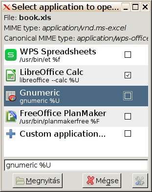

# mimeopen-gui
Graphical "Open with..." application chooser for Freedesktop compatible environments

## Screenshots

## Usage

- `mimeopen-gui [<FILE> | <URL>]` shows a list of applications in a normal Gtk2 window which claim to be able to open the given file or URL.
- default apps are sorted to the top
- tick the checkbox in an application's row to make it default

# issues
Please submit issues via PR to some file `<TITLE>.txt` or `<TITLE>.md` on `issues` branch.
